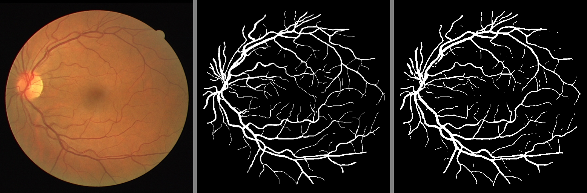

该项目为基于unet和pytorch对眼底血管进行分割

使用前需要将"DRIVE"文件夹进行解压缩，由于数据集较小，需要先使用"data_aug.py"进行数据增强,增强的数据放在"new_data"中

接着运行unet文件夹中的"train.py"进行模型训练，训练完的模型参数放在unet/files/checkpoint.pth，训练建议在有cuda的机器上训练，否则时间感人

"test.py"为预测，运行可以看到模型对原图所进行的黑白血管分割图，结果放在unet/results/中，如下为其中一个结果：

其中左边为原图，中间是mask，最右是模型分割出来的结果

